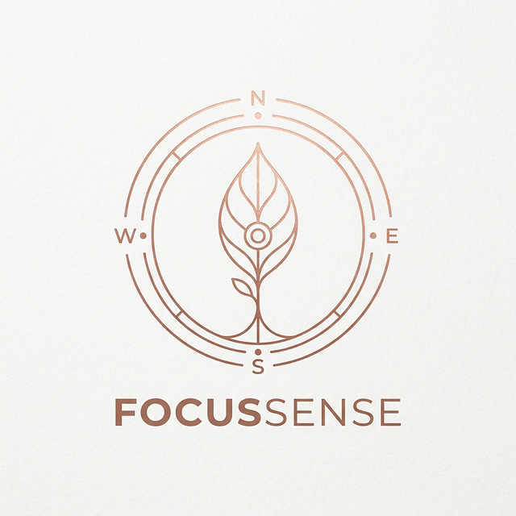

# 🌿 FocusSense

<p align="center">
  
</p>

**FocusSense** is a next-generation, ethical productivity sanctuary designed to transform the way we relate to deep work. It moves away from "shame-based" tracking and instead uses gamification, local-first privacy, and AI-driven insights to help you cultivate focus.

## ✨ Features

- **Farm Gamification**: Your focus minutes nourish crops, grow a pond, and build your farm life.
- **Privacy-First Monitoring**: A local-only Python agent monitors application titles with zero cloud footprint.
- **AI Coach & Planner**: Analyze focus patterns to schedule tasks based on actual cognitive peaks.
- **Data Sovereignty**: Your focus history is stored locally. Export to JSON/CSV anytime.
- **One-Click Pairing**: Seamless, secure handshake between the UI and Desktop Agent.

## 🚀 Getting Started

### 1. Run the Desktop Agent
```bash
python agent/main.py
```

### 2. Start the App
```bash
npm install
npm run tauri dev
```

## 🛠️ Tech Stack

- **Frontend**: React + Vite + PixiJS
- **Desktop**: Tauri (Rust)
- **Agent**: Python (WebSockets)
- **State**: LocalStorage Persistence

---
*Built with focus and ethics in mind.*
