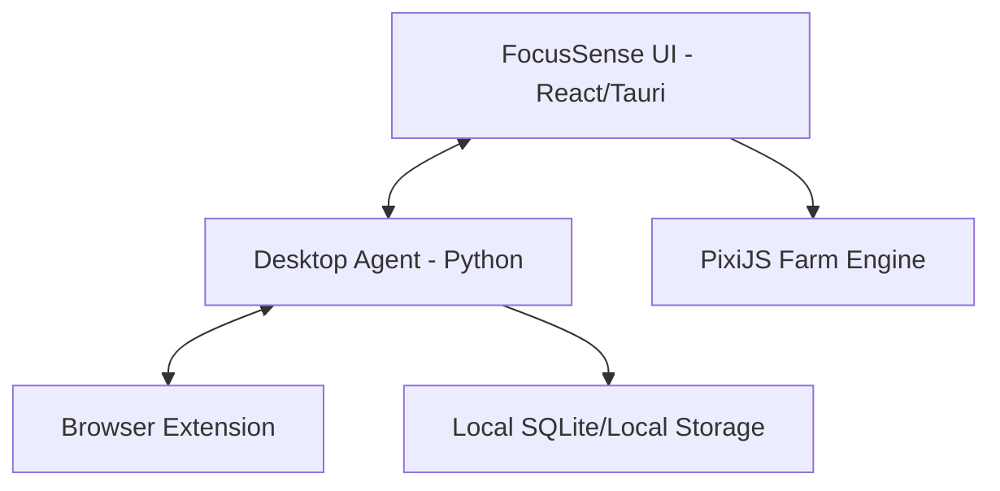

# 🌿 FocusSense

[](https://opensource.org/licenses/MIT)
[](https://tauri.app/)
[](https://reactjs.org/)
[](https://www.python.org/)

<p align="center">
  
</p>

**FocusSense** is a next-generation, ethical productivity sanctuary designed to transform the way we relate to deep work. It moves away from "shame-based" tracking and instead uses gamification, local-first privacy, and AI-driven insights to help you cultivate focus.

---

## 📖 Table of Contents
- [✨ Features](#-features)
- [🖼️ Visuals](#-visuals)
- [🛠️ Tech Stack](#️-tech-stack)
- [🚀 Getting Started](#-getting-started)
  - [Prerequisites](#prerequisites)
  - [Installation](#installation)
  - [Usage](#usage)
- [🤝 Contributing](#-contributing)
- [⚖️ License](#️-license)
- [📧 Support/Contact](#-supportcontact)
- [🙏 Acknowledgments](#-acknowledgments)

---

## ✨ Features

- **🚜 Farm Gamification**: Your focus minutes nourish crops, grow a pond, and build your farm life. Watch your digital sanctuary flourish as you master your attention.
- **🛡️ Privacy-First Monitoring**: A local-only Python agent monitors application titles with zero cloud footprint. Your data never leaves your machine.
- **🤖 AI Coach & Planner**: Analyze focus patterns to schedule tasks based on your actual cognitive peaks, not just a static calendar.
- **📂 Data Sovereignty**: Your focus history is stored locally. Export to JSON/CSV anytime for your own analysis.
- **🤝 One-Click Pairing**: Seamless, secure handshake between the UI and Desktop Agent via local WebSockets.

---

## 🖼️ Visuals

<p align="center">
  <i>(Include screenshots or GIFs here to showcase the Farm World and Analytics Dashboard)</i>
</p>

### System Architecture


---

## 🛠️ Tech Stack

- **Frontend**: [React](https://react.dev/) + [Vite](https://vitejs.dev/) + [PixiJS](https://pixijs.com/) (Rendering Engine) + [Recharts](https://recharts.org/) (Analytics)
- **Desktop Framework**: [Tauri](https://tauri.app/) (Rust-based efficiency)
- **Activity Agent**: [Python](https://www.python.org/) (WebSockets, `psutil`, `pygetwindow`)
- **Browser Integration**: Standard Web Extension (JavaScript)
- **Communication**: Local WebSockets for low-latency, private data syncing.

---

## 🚀 Getting Started

### Prerequisites
- [Node.js](https://nodejs.org/) (v18+)
- [Python 3.10+](https://www.python.org/)
- [Rust](https://www.rust-lang.org/tools/install) (for building the Tauri app)

### Installation

1. **Clone the repository**:
   ```bash
   git clone https://github.com/your-username/focussense.git
   cd focussense
   ```

2. **Install Frontend Dependencies**:
   ```bash
   npm install
   ```

3. **Setup the Python Agent**:
   ```bash
   cd agent
   python -m venv .venv
   source .venv/bin/activate  # On Windows: .venv\Scripts\activate
   pip install -r requirements.txt
   ```

### Usage

1. **Start the Desktop Agent**:
   ```bash
   # From the agent directory
   python main.py
   ```

2. **Launch the Application**:
   ```bash
   # From the root directory
   npm run tauri dev
   ```

3. **Install the Extension**:
   Load the `extension` folder as an unpacked extension in your Chrome/Edge browser.

---

## 🤝 Contributing

We welcome contributions to FocusSense! To contribute:
1. Fork the Project.
2. Create your Feature Branch (`git checkout -b feature/AmazingFeature`).
3. Commit your Changes (`git commit -m 'Add some AmazingFeature'`).
4. Push to the Branch (`git push origin feature/AmazingFeature`).
5. Open a Pull Request.

Please see [CONTRIBUTING.md](CONTRIBUTING.md) for more details.

---

## ⚖️ License

Distributed under the MIT License. See `LICENSE` for more information.

---

## 📧 Support/Contact

- **Issues**: Open a ticket on our [GitHub Issue Tracker](https://github.com/your-username/focussense/issues).
- **Email**: support@focussense.ai (Placeholder)

---

## 🙏 Acknowledgments

- [PixiJS](https://pixijs.com/) for the incredible 2D engine.
- [Tauri](https://tauri.app/) for making secure desktop apps easy.
- All the focus researchers whose work inspired the "ethical productivity" approach.

---
*Built with focus and ethics in mind.*
