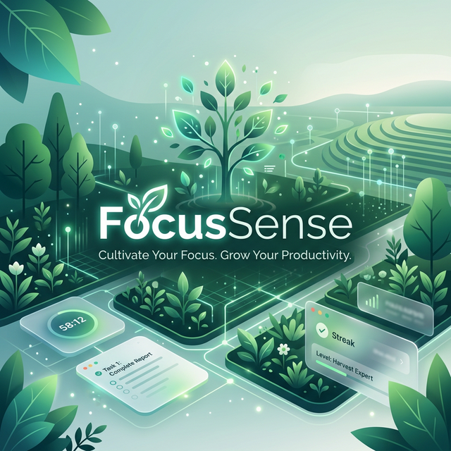

<p align="center">
  
</p>

<h1 align="center">FocusSense</h1>

<p align="center">
  <strong>Your ethical productivity sanctuary — grow a farm, master your focus.</strong>
</p>

<p align="center">
  
  
  
  
</p>

---

## What is FocusSense?

FocusSense is a **privacy-first, gamified focus tracker** for Windows. Instead of shaming you for distractions, it rewards deep work — every focused minute grows your digital pixel-art farm. It monitors your active window via a local Python agent (zero cloud, zero tracking), builds an AI-powered picture of your cognitive peaks, and helps you work *with* your brain, not against it.

> **Note:** No pre-built installer is available yet. Use the [Developer Setup](#-developer-setup) below to build and run the app locally.

---

## Table of Contents

- [Features](#-features)
- [Developer Setup](#-developer-setup)
  - [Prerequisites](#prerequisites)
  - [1 — Clone & Install](#1--clone--install)
  - [2 — Python Activity Agent](#2--python-activity-agent)
  - [3 — Run the App](#3--run-the-app)
  - [4 — Browser Extension (Optional)](#4--browser-extension-optional)
- [How It Works](#-how-it-works)
- [Tech Stack](#-tech-stack)
- [License](#-license)

---

## Features

| Feature | Description |
|---|---|
| **Farm Gamification** | Focus minutes grow crops, fill a pond, and build your farm. Your attention has visible, rewarding consequences. |
| **Local-Only Privacy** | A local Python agent reads your active window title. No data ever leaves your machine. No accounts. No cloud. |
| **AI Focus Coach** | Analyzes your focus history to identify your peak hours and schedule tasks around your actual cognitive rhythm. |
| **Multiple Work Modes** | Switch between Deep Work, Study, Creative, Admin, and more — each with its own themed UI and timer style. |
| **Analytics Dashboard** | Recharts-powered graphs showing daily focus totals, mood trends, category breakdowns, and session history. |
| **Pomodoro + Stopwatch** | Built-in Pomodoro timer and freeform stopwatch modes with automatic session logging. |
| **Data Export** | Export your full focus history as JSON or CSV for personal analysis. |
| **One-Click Agent Pairing** | Secure local WebSocket handshake — connect your Python agent in one click with no manual configuration. |

---

## Developer Setup

### Prerequisites

- [Node.js 18+](https://nodejs.org/)
- [Rust (stable)](https://www.rust-lang.org/tools/install)
- [Python 3.10+](https://www.python.org/downloads/)

---

### 1 — Clone & Install

```bash
git clone https://github.com/yashitamoulin01-star/Focussense.git
cd Focussense
npm install
```

---

### 2 — Python Activity Agent

The app timer works without the agent, but **app/website tracking** requires it.

**One-time setup:**

```bash
cd agent

# Create virtual environment
python -m venv .venv

# Activate (PowerShell)
.venv\Scripts\Activate.ps1
# Activate (Command Prompt)
.venv\Scripts\activate

# Install dependencies
pip install -r requirements.txt
```

**Run it (every time you want tracking):**

```bash
python main.py
```

The agent will start silently on `ws://127.0.0.1:8765`. In FocusSense, click **Connect Agent** in the sidebar — the button will turn green when paired.

---

### 3 — Run the App

Start the app and agent in **separate terminals**:

**Terminal 1 — Python Agent:**
```bash
cd agent
.venv\Scripts\Activate.ps1
python main.py
```

**Terminal 2 — Tauri Dev App:**
```bash
npm run tauri dev
```

> **Web-only mode** (no desktop window, no Rust required):
> ```bash
> npm run dev
> # Open http://localhost:1420
> ```

**Build a production installer:**
```bash
npm run tauri build
# Output: src-tauri/target/release/bundle/nsis/FocusSense_x.x.x_x64-setup.exe
```

---

### 4 — Browser Extension (Optional)

For per-website tracking (not just "browser is open"):

1. Open Chrome or Edge → go to `chrome://extensions`
2. Enable **Developer Mode** (top-right toggle)
3. Click **Load unpacked**
4. Select the `extension/` folder from the repo

The extension sends the active tab's title and URL to the agent automatically.

---

## How It Works

```
┌─────────────────────────────┐        ┌──────────────────────────┐
│   FocusSense UI             │        │  Python Activity Agent   │
│   (Tauri + React + PixiJS)  │◄──────►│  (psutil + pygetwindow)  │
│                             │  WS    │                          │
│  • Farm canvas (PixiJS)     │        │  • Reads active window   │
│  • Timer & sessions         │        │  • Sends app name + URL  │
│  • Analytics (Recharts)     │        │  • ws://127.0.0.1:8765   │
│  • AI coach                 │        └──────────────────────────┘
│  • localStorage data        │
└─────────────────────────────┘        ┌──────────────────────────┐
                                       │  Browser Extension       │
                                       │  (Chrome / Edge)         │
                                       │  • Sends tab title/URL   │
                                       └──────────────────────────┘
```

All communication is local WebSocket (`ws://127.0.0.1:8765`). No internet connection required after setup.

---

## Tech Stack

| Layer | Technology |
|---|---|
| Desktop Framework | [Tauri v2](https://tauri.app/) (Rust) |
| Frontend | [React 19](https://react.dev/) + [Vite 7](https://vitejs.dev/) |
| Farm Rendering | [PixiJS v7](https://pixijs.com/) (WebGL 2D engine) |
| Analytics Charts | [Recharts](https://recharts.org/) |
| Activity Agent | Python 3 (`psutil`, `pygetwindow`, `websockets`) |
| Browser Extension | Vanilla JS Web Extension (Chrome/Edge) |
| Data Storage | `localStorage` (fully local, no database server) |
| Communication | Local WebSockets (zero network egress) |

---

## License

**Proprietary — All Rights Reserved.**

Copyright © 2026 Yashita Moulin.

You may clone and personally use/build the code. You may view the source for reference. You may **not** copy, redistribute, modify, or replicate the concept, design, or code in another product.

See [LICENSE](LICENSE) for the full legal terms.

---

<p align="center">
  Built with focus, ethics, and a lot of pixel-art love.
</p>
